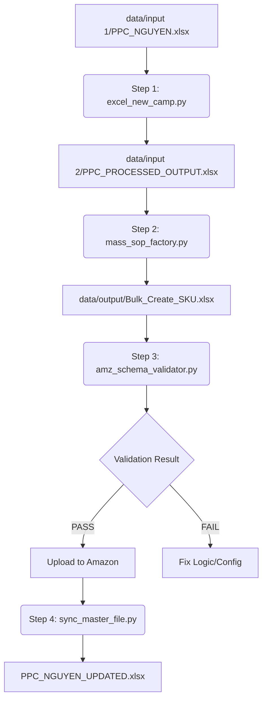

# Technical Documentation: C_mass_sop_factory
## Automation Engine for Amazon Ads Bulk Operations

Hệ thống **C_mass_sop_factory** là một giải pháp tự động hóa quy trình xử lý dữ liệu quảng cáo Amazon (PPC), chuyển đổi các kế hoạch từ file Tracking Master thành các tệp tin **Amazon Bulk Operations (V3)** sẵn sàng để upload. Hệ thống này giúp loại bỏ các thao tác thủ công, giảm thiểu sai sót và chuẩn hóa cấu trúc đặt tên campaign.

---

## 1. Project Overview (Tổng quan hệ thống)

Dự án này đóng vai trò là "nhà máy" sản xuất các kịch bản vận hành (SOP) hàng loạt. Nó nhận đầu vào là các tệp Excel chứa danh sách Keyword/ASIN và các chỉ số Bidding, sau đó thực hiện:
- **Lọc và Phân loại**: Tự động nhận diện các SKU cần triển khai mới.
- **Parsing & Extraction**: Bóc tách các thông số Match Type, Bid, và Placement từ các chuỗi ghi chú (Notes) không cấu trúc.
- **Transformation**: Chuyển đổi dữ liệu sang định dạng 7-row block chuẩn của Amazon (Campaign -> Bidding Adjustments x3 -> Ad Group -> Product Ad -> Keyword/Targeting).
- **Validation**: Kiểm tra tính toàn vẹn của dữ liệu trước khi vận hành thực tế.

---

## 2. System Architecture (Kiến trúc hệ thống)

Hệ thống hoạt động theo mô hình **Sequential Data Pipeline** gồm 4 giai đoạn chính:

### Directory Structure
- `data/input 1/`: Chứa file Master (PPC_*.xlsx) - Nguồn dữ liệu gốc.
- `data/input 2/`: Chứa dữ liệu trung gian đã qua xử lý (Intermediate Storage).
- `data/output/`: Chứa các file Bulk Operations cuối cùng, phân loại theo từng SKU.
- `core_logic/`: (Logic nằm trực tiếp trong các script chính để đảm bảo tính self-contained).

---

## 3. Core Engines (Các động cơ chính)

### 3.1. Regex-based Note Parser
Đây là linh hồn của hệ thống, cho phép người dùng nhập Ghi chú (Notes) một cách tự do nhưng vẫn đảm bảo máy hiểu được.
- **Khả năng bóc tách**:
    - **Match Type**: Tự động nhận diện `exact`, `phrase`, `broad`, `targeting`, `auto`.
    - **Bids**: Tìm kiếm các giá trị số (ví dụ: `0.5`, `0.7Đ`) để thiết lập giá thầu.
    - **Placements**: Nhận diện các ký tự viết tắt `T` (Top), `R` (Rest), `P` (Product Page) kèm con số phần trăm (ví dụ: `50T`, `30TRP`).

### 3.2. Campaign Naming Engine
Tự động sinh tên Campaign theo quy chuẩn SEO và quản lý:
`[SKU]_[LoaiCamp]_[Match_Type]_[Keyword_Slug]_[Placement_Tag]`
*Ví dụ*: `DEVOM_KT_exact_250 anniversary_50T`

### 3.3. Bulk Transformer (7-Row Block Logic)
Để tạo một chiến dịch hoàn chỉnh trên Amazon qua file Bulk, hệ thống tự động sinh ra 7 dòng thực thể (Entities) liên kết với nhau bằng `Campaign Id` và `Ad Group Id`:
1. **Campaign**: Khởi tạo chiến dịch.
2. **Bidding Adjustment (Top)**: Cấu chỉnh % cho vị trí Top.
3. **Bidding Adjustment (Product Page)**: Cấu chỉnh % cho trang sản phẩm.
4. **Bidding Adjustment (Rest)**: Cấu chỉnh % cho các vị trí còn lại.
5. **Ad Group**: Khởi tạo nhóm quảng cáo.
6. **Product Ad**: Gán SKU vào nhóm.
7. **Keyword/Targeting**: Gán mục tiêu quảng cáo và giá thầu.

---

## 4. Rule Configuration & Scripting Contract

### 4.1. Note Scripting Contract
Người dùng cần tuân thủ cấu trúc trong cột "Ghi chú" để Engine hoạt động chính xác:

| Thành phần | Ví dụ hợp lệ | Ghi chú |
| :--- | :--- | :--- |
| **Match Type** | `exact`, `ex`, `phrase`, `ph`, `pt` | Không phân biệt hoa thường. |
| **Bid** | `0.5`, `0.65`, `1.2Đ` | Giá thầu mặc định là 0.5 nếu không tìm thấy. |
| **Placement** | `50T`, `30RP`, `20TRP` | Số đứng trước chữ cái đại diện vị trí. |

### 4.2. Input Spreadsheet Schema
- **Sheet `Listing`**: Cần có các cột `SKU`, `Portfolio Id`, `Status`.
- **Sheet `SKU`**: Tên sheet phải trùng với SKU. Cần các cột `STT`, `Target`, `Loại Campaign`, `Ghi chú`, `Trạng thái`.

---

## 5. Standard Operating Procedure (SOP)
### Hướng dẫn vận hành hàng tuần cho End-User

| Thứ | Hành động | Script thực hiện | Lưu ý |
| :--- | :--- | :--- | :--- |
| **Thứ 2-3** | Cập nhật Master file: Thêm keyword mới, chuyển trạng thái SKU sang `Công việc Mới`. | N/A | Kiểm tra kỹ Portfolio ID. |
| **Thứ 4** | Chạy Pipeline Bước 1: Tiền xử lý dữ liệu và tách Keyword multi-line. | `python excel_new_camp.py` | Kiểm tra file tại `data/input 2`. |
| **Thứ 5** | Chạy Pipeline Bước 2: Xuất tệp Bulk Operations theo SKU. | `python mass_sop_factory.py` | Kiểm tra file tại `data/output`. |
| **Thứ 5** | Kiểm tra chất lượng (QC): So khớp cấu trúc cột với Template Amazon. | `python amz_schema_validator.py` | Xem report tại `validation_report.txt`. |
| **Thứ 6** | Upload file lên Amazon Console & Đồng bộ trạng thái vào file Master. | `python sync_master_file.py` | Trạng thái sẽ chuyển sang `Chờ Upload`. |

---
**Technical Lead**: Antigravity AI
**Version**: 5.0 (Stable)
**Status**: Production Ready
