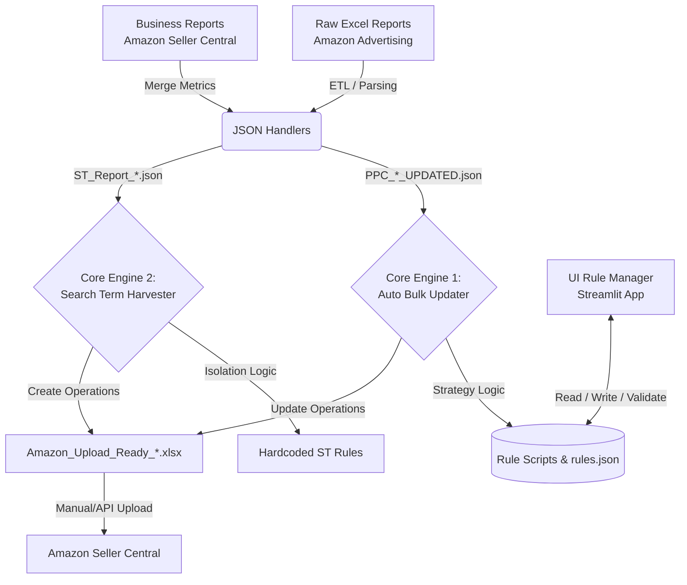

# Amazon PPC Automated Trading System
**Technical Documentation & System Architecture**

## 1. Project Overview (Tổng quan hệ thống)

**Amazon PPC Automated Trading System** (Folder D) là một hệ thống tự động hóa quản lý giá thầu (Automated Bidding) và tối ưu hóa từ khóa dành cho nền tảng quảng cáo Amazon Advertising. Hệ thống được thiết kế theo kiến trúc Data Pipeline khép kín nhằm giải quyết triệt để các bài toán cốt lõi trong Amazon PPC:
- **Cắt máu tự động (Bleeder Mitigation):** Phát hiện và chặn đứng lập tức các nguồn traffic tiêu tốn ngân sách mà không sinh ra chuyển đổi.
- **Tối ưu Placement (Placement Optimization):** Tự động điều chỉnh hệ số Bid (Bidding Adjustment) dựa trên hiệu suất (CVR) của từng vùng hiển thị (Top of Search, Product Pages).
- **Phân tách từ khóa (Search Term Isolation):** Tự động thu hoạch (Harvesting) các truy vấn tìm kiếm sinh lời (Winner) và cô lập các truy vấn không hiệu quả (Negative Exact) để tránh hiện tượng tự ăn thịt lẫn nhau (Cannibalization).
- **Vắt sữa lợi nhuận (Profit Milking):** Tích hợp Business Reports để đánh giá đỉnh điểm tìm kiếm tự nhiên (Organic Peak), từ đó chủ động hạ giá thầu nhằm tối đa hóa biên độ lợi nhuận khi ASIN đã chiếm lĩnh trang 1.

### Sơ đồ luồng dữ liệu (Data Pipeline Flow)



---

## 2. System Architecture (Kiến trúc hệ thống)

Hệ thống được thiết kế hoàn toàn theo **Kiến trúc Modular (Strategy Pattern)**. Kiến trúc này tạo ra sự phân tách rõ rệt giữa **"Trạm trung chuyển dữ liệu" (Core Engine)** và **"Bộ não ra quyết định" (Strategy Modules)**.

Thay vì hardcode các điều kiện `if/else` chằng chịt vào một file duy nhất, hệ thống nạp các luật từ `rules.json` và gọi động (dynamically import) các script xử lý tương ứng trong thư mục `rule_scripts/`.

> [!TIP] **Lợi ích cốt lõi của kiến trúc:**
> - **Dễ dàng mở rộng (Scalability):** Thêm chiến lược thầu mới chỉ bằng cách tạo một file `.py` mới trong `rule_scripts/` và khai báo cấu hình vào `rules.json` mà không lo phá vỡ logic cốt lõi.
> - **Chịu lỗi tốt (Fault Tolerance):** Nếu một script con bị lỗi (hoặc không tồn tại), hệ thống sẽ `try/except`, tự động Fallback về bộ đánh giá tĩnh (Static Evaluator) và bỏ qua an toàn, giúp toàn bộ Data Pipeline không bao giờ bị Crash.
> - **Tách biệt Logic (Separation of Concerns):** Core Engine chỉ tập trung lo việc IO (đọc dữ liệu, build file Excel chuẩn), còn các thuật toán thầu (Bidding Algorithm) được cô lập hoàn toàn vào các Strategy Modules.

---

## 3. Core Engines (Các động cơ chính)

### Engine 1: `auto_bulk_updater.py` (Bid & Keyword Manager)
Là động cơ chính phụ trách tối ưu hóa các Entity đã tồn tại (Existing Keywords, Targets).
- **Input:** 
  - Các file báo cáo `PPC_*_UPDATED.json` (chứa dữ liệu Targeting đã được merge với Business Report).
  - Cấu hình luật từ `rules.json` (Được quản lý thông qua giao diện `ui_rule_manager.py`).
- **Nhiệm vụ:**
  - Trích xuất và nội suy (Interpolation) **13 thông số tĩnh** (Full-Funnel Metrics: Impressions, Clicks, Spend, Sales, Orders, ACOS, ROAS, CTR, CVR, CPC, Units, *total_sales*, *total_orders*) kết hợp cùng `current_bid`.
  - Gọi các chiến thuật từ `rule_scripts/` để ra quyết định: Chặn trần giá thầu (Bid Capping), Tạm dừng (Pause Keywords), hoặc Tăng hệ số hiển thị (Placement Modifier).
- **Output:** File Bulk định dạng Amazon Advertising V3 với giá trị cột `Operation` là `Update`.

### Engine 2: `st_harvester.py` (Search Term Harvester)
Là động cơ độc lập chuyên phân tích hành vi tìm kiếm thực tế của người dùng và tạo Entity mới.
- **Input:** Báo cáo thuật ngữ tìm kiếm `ST_Report_*.json`.
- **Nhiệm vụ:**
  - Phân loại **Bleeder Term (Nhánh 1):** Clicks cao, 0 Order $\rightarrow$ Tạo `Negative Exact` tại Campaign gốc.
  - Phân loại **Winner Term (Nhánh 2):** Có Order $\rightarrow$ Thực hiện **2 hành động đồng thời** để chống ăn thịt (Cannibalization):
    1. Tạo `Negative Exact` tại Campaign gốc (Negate in Source).
    2. Tạo `Exact Match` Keyword tại Campaign mới (Tên gốc + suffix `_Exact`), tự động set Base Bid = `CPC * 1.2` để push rank.
- **Output:** File Bulk định dạng Amazon Advertising V3 với giá trị cột `Operation` là `Create`.

---

## 4. Rule Configuration & Scripting Contract

### Cấu trúc file cấu hình `rules.json`
Đóng vai trò là Source of Truth (Nguồn chân lý) chứa các tham số ngưỡng (Thresholds) cho toàn bộ chiến dịch.
```json
{
    "rule_name": "Exact_Match_Controller",
    "conditions": { "impressions_min": 1, "clicks_min": 1 },
    "match_type_logic": {
        "exact": { "low_click_bid_cap": 0.68, "pause_click_min": 10 }
    },
    "action": "Update",
    "target_entity": "Keyword",
    "log_template": "Exact Triggered: {clicks} Clicks, CTR {ctr}%."
}
```

### Quản lý cấu hình bằng UI (`ui_rule_manager.py`)
Hệ thống cung cấp một ứng dụng Giao diện trực quan viết bằng Streamlit để giúp End-user dễ dàng tùy biến file `rules.json` mà không cần can thiệp mã nguồn:
- Trực quan hóa toàn bộ rules thành các thẻ (expander) dễ quản lý.
- Tự động map đúng các Input Control (Slider, Number Input, Selectbox).
- Hỗ trợ Validation dữ liệu đầu vào và lưu file an toàn, tránh phá hỏng cú pháp JSON.

### Scripting Contract (Giao thức cho Module con)
Mọi file Python đặt trong thư mục `rule_scripts/` bắt buộc phải tuân thủ nghiêm ngặt **Contract** sau:

1. **Signature chuẩn:** Hàm entry point phải là `execute`.
```python
def execute(rule_config: dict, metrics: dict, match_type: str) -> list:
```
2. **Xử lý số liệu an toàn:** Sử dụng `metrics.get('key', 0)` để đọc chỉ số.
3. **Output Payload:**
   - Phải trả về một `list` các `dict` (dù chỉ có 1 hành động).
   - Nếu không thỏa mãn điều kiện, trả về `[]` (rỗng).
   - Payload dictionary phải chứa các biến để Core Engine map vào Bulk File. Ví dụ:
     - Dành cho Keyword: `{'action': 'Paused', 'target_entity': 'Keyword', 'set_bid': 0.68}`
     - Dành cho Placement: `{'target_entity': 'Bidding Adjustment', 'placement_type': 'Placement Top', 'set_percentage': 25}`

---

## 5. Standard Operating Procedure (SOP) - Giao thức vận hành

Để hệ thống hoạt động mượt mà theo chu kỳ thuật toán của Amazon, End-User (hoặc Automation Scheduler) nên tuân thủ lịch trình hàng tuần sau:

### Thứ 2: Giai đoạn Harvesting & Discovery (Khai hoang mở rộng)
> Tập trung xử lý các Search Term mới thu thập được từ tuần lễ trước.
1. **Chạy Engine 2:** Chạy lệnh `python core_logic/st_harvester.py`.
2. **Review & Upload:** Mở file `Amazon_Upload_Ready_ST_Harvest_*.xlsx`, kiểm tra log và upload lên Seller Central.
3. **Troubleshoot:** Xử lý các lỗi *"Entity Not Found"* của Amazon bằng cách: Tạo thủ công các Campaign `_Exact` nếu hệ thống Amazon chưa kịp khởi tạo Campaign mới dựa theo tệp Bulk tải lên.

### Thứ 4 & Thứ 6: Giai đoạn Maintenance (Bảo trì & Tối ưu)
> Tập trung bóp chi phí (Capping/Pausing) và Push Rank cho Keyword đã định vị.
1. **Chạy Engine 1:** Chạy lệnh `python core_logic/auto_bulk_updater.py`.
2. **Review & Upload:** Mở file `Amazon_Upload_Ready_*.xlsx` để xác minh các lệnh `Update` (Set_bid, Pause, Adjust_bid_by).
3. **Monitor:** Đảm bảo các chỉ số tài chính (ACOS, Spend) trên bảng điều khiển Seller Central đang điều chỉnh đúng hướng so với tuần trước.
