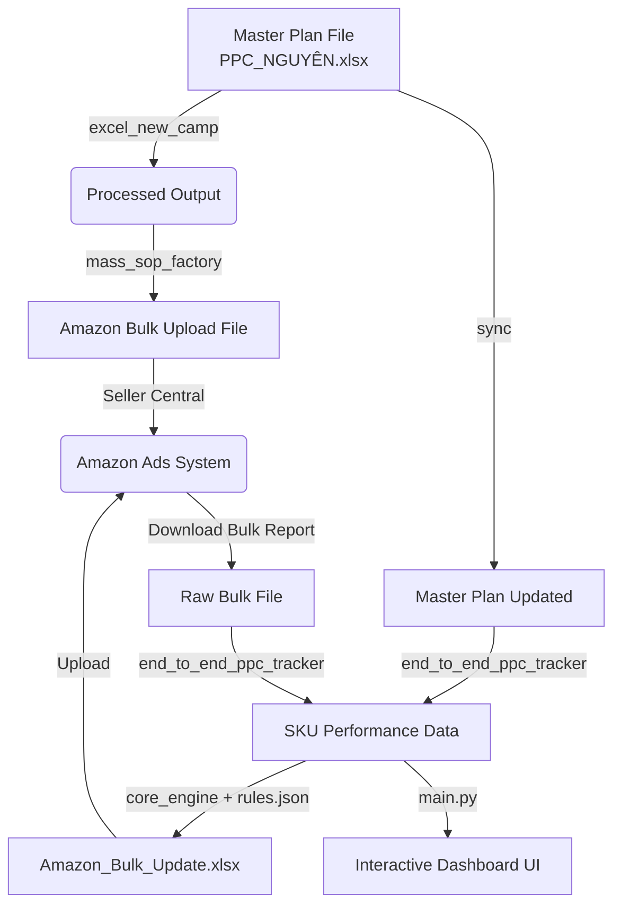

# 📦 Hệ Thống Amazon Ads Trading - UI & Core Engine Documentation

## 1. Project Overview (Tổng quan hệ thống)
- **Định nghĩa:** Hệ thống Amazon Ads Trading là một nền tảng tự động hóa toàn diện vòng đời của một chiến dịch quảng cáo Amazon PPC. Từ khâu thiết lập kế hoạch (Campaign Generation), đồng bộ file Master, thu thập báo cáo hiệu suất (Data Pipeline) đến tự động tối ưu hóa giá thầu (Bid Optimization) và trạng thái (Pause/Enable) dựa trên các quy tắc kinh doanh cấu hình trước.
- **Giải quyết bài toán:** Loại bỏ hoàn toàn quy trình xử lý Excel thủ công tốn thời gian, giảm thiểu lỗi do thao tác tay (Human Error), và tăng tốc độ phản ứng với thị trường thông qua các quyết định bằng thuật toán (Data-driven logic).

**Sơ đồ Data Pipeline cơ bản:**

## 2. System Architecture (Kiến trúc hệ thống)

**Kiến trúc Strategy Pattern:**
Hệ thống được thiết kế mạnh mẽ dựa trên **Strategy Pattern**, tách rời hoàn toàn *Động cơ thực thi (Execution Engine - `core_engine.py`)* và *Quy tắc kinh doanh (Business Logic - `rules.json`)*. 

- **Giải thích:** Thay vì hardcode các thuật toán điều chỉnh bid (ví dụ `if click > 10 then bid - 0.1`) trực tiếp vào mã nguồn Python, mọi luật lệ đều được đưa ra ngoài dưới dạng file định dạng `JSON`. Động cơ (Core Engine) đóng vai trò quét qua DataFrame, áp dụng các điều kiện trong JSON, và tính toán kết quả mà không cần quan tâm nội dung của luật đó là gì.
- **Lợi ích:**
  - **Dễ dàng mở rộng (Scale):** Người vận hành (Data Engineer hoặc Ads Specialist) có thể tự do thêm hàng chục chiến lược điều chỉnh bid mới chỉ bằng cách viết thêm cấu hình JSON.
  - **Chịu lỗi tốt (Fault Tolerance):** Giảm thiểu rủi ro sinh ra lỗi cú pháp Python do không phải thay đổi mã nguồn gốc thường xuyên. Dễ dàng rollback lại file JSON về phiên bản trước nếu chiến lược mới hoạt động không hiệu quả.
  - **Không bị Hardcode:** Đảm bảo tính linh hoạt tối đa khi có sự thay đổi thuật toán từ Amazon Ads.

## 3. Core Engines (Các động cơ/ file code chính)

Hệ thống được cấu thành từ các động cơ xử lý độc lập trong các thư mục từ `C_` đến `F_` và UI.

| Động cơ (Code File) | Nhiệm vụ chính | Input | Output | Thứ tự |
| :--- | :--- | :--- | :--- | :---: |
| `excel_new_camp.py` | Lọc các SKU có trạng thái "Tiếp nhận/Công việc mới", tự động nhân bản từ khóa ra các Match Type (Exact, Phrase, Broad). | `PPC_NGUYÊN.xlsx` | `PPC_PROCESSED_OUTPUT.xlsx` | 1 |
| `mass_sop_factory.py` | Ánh xạ và chuyển đổi dữ liệu từ khóa thành file Bulk theo đúng format của Amazon (Campaign, Ad Group, Keyword...). | `PPC_PROCESSED_OUTPUT.xlsx` | `Bulk_*.xlsx` | 2 |
| `sync_master_file.py` | Đồng bộ trạng thái ngược về Master file, đổi trạng thái thành "Chờ Upload" để tránh trùng lặp cho lần chạy sau. | `PPC_PROCESSED_OUTPUT.xlsx` | `PPC_NGUYÊN_UPDATED.xlsx` | 3 |
| `end_to_end_ppc_tracker.py` | Thu thập chỉ số từ Amazon Bulk report, tiến hành nối ngang (Horizontal Appending) dữ liệu vào Master file để lưu trữ chuỗi thời gian. | `PPC_NGUYÊN.xlsx` + `bulk-*.xlsx` | `PPC_NGUYÊN_UPDATED.xlsx` (Ver mới) | 4 |
| `core_engine.py` | Quét dữ liệu hiệu suất, đối chiếu với các rule JSON và tạo lệnh cập nhật thay đổi (Bid, Status). | `bulk-*.xlsx` + `rules.json` | `Final_Upload_Ready.xlsx` | 5 |
| `UI/main.py` | Tổng hợp dữ liệu từ Master Plan, làm sạch (ETL) và gọi View Controller (`ui_builder.py`) để sinh ra Dashboard Interactive Excel. | Các file `PPC_*_UPDATED.xlsx` | `AMZ_Interactive_Dashboard.xlsx` | 6 |

## 4. Rule Configuration & Scripting Contract

Thư mục **F_core_engine** chứa hệ thống Rule được kiểm soát chặt chẽ thông qua file `rules.json`.
Hợp đồng dữ liệu (Data Contract) cấu trúc mỗi Rule bao gồm 3 thành phần chính để Core Engine xử lý:

1. `_comment`: Chú thích rõ ràng nhiệm vụ của rule để dễ theo dõi và debug.
2. `conditions`: Tập hợp các điều kiện bắt buộc kích hoạt (Condition Mapping).
   - `target_entity`: Đối tượng tác động (Campaign, Keyword, Bidding Adjustment...).
   - `campaign_contains`, `match_type_contains`, `placement_type`: Regex/Substring nhận diện theo tên.
   - `metric_conditions`: Mảng các điều kiện toán học (`column`, `operator`, `value`). Ví dụ: `Impressions < 100`.
3. `actions`: Hành động diễn ra khi điều kiện đã thỏa mãn.
   - `action_type`: Kiểu thao tác (`set_value`, `increase_value`, v.v.).
   - `target_column`: Cột dữ liệu sẽ nhận giá trị cập nhật (Bid, Percentage, Status).
   - `value`: Giá trị thay đổi.

**Yêu cầu nghiêm ngặt:** Toàn bộ Rule Configuration phải đúng chuẩn JSON Array và đáp ứng schema trên. Chỉ những Rule có cấu trúc hợp lệ này mới được Load vào Pipeline xử lý bộ nhớ của `core_engine.py`.

## 5. Standard Operating Procedure (SOP - Giao thức vận hành)

**Lịch trình vận hành hệ thống hàng tuần dành cho End-User:**

*   **Thứ Hai (Khởi tạo chiến dịch mới):**
    1. Cập nhật kế hoạch từ khóa vào `data/input/PPC_NGUYÊN.xlsx` (đánh dấu trạng thái "Tiếp nhận").
    2. Chạy `C_mass_sop_factory/excel_new_camp.py` để thiết lập dữ liệu sơ cấp.
    3. Chạy `mass_sop_factory.py` để build file Amazon Bulk.
    4. Upload trực tiếp các file `Bulk_*.xlsx` mới tạo lên hệ thống Amazon Seller Central.
    5. Chạy `sync_master_file.py` để khóa trạng thái "Chờ Upload", khép kín quy trình tạo mới.

*   **Thứ Tư (Tracking & Cập nhật Dữ liệu Dashboard):**
    1. Tải báo cáo "Sponsored Products Campaigns" từ Amazon qua chế độ Bulk.
    2. Ném file báo cáo tải về vào thư mục quy định (`data/input 1/`).
    3. Chạy `D_auto_bulk_updater/end_to_end_ppc_tracker.py` để kéo ngang dữ liệu.
    4. Mở terminal, chạy script `UI/main.py`. Lấy file `AMZ_Interactive_Dashboard.xlsx` trong `UI/data/output/` gửi cho Ban Giám Đốc theo dõi.

*   **Thứ Sáu (Tối ưu hóa Giá thầu tự động - Bid Optimization):**
    1. Rà soát file `F_core_engine/rules.json` nếu có chiến lược thay đổi hoặc muốn nạp Rule mới.
    2. Chạy `F_core_engine/core_engine.py` và trỏ đường dẫn file thao tác tới file Amazon Bulk Report cập nhật mới nhất.
    3. Upload file `Final_Upload_Ready.xlsx` thu được lên Amazon Seller Central để hệ thống tự động thiết lập lại toàn bộ cấu trúc Capping Bid và Status Keyword cho các ngày cuối tuần.
